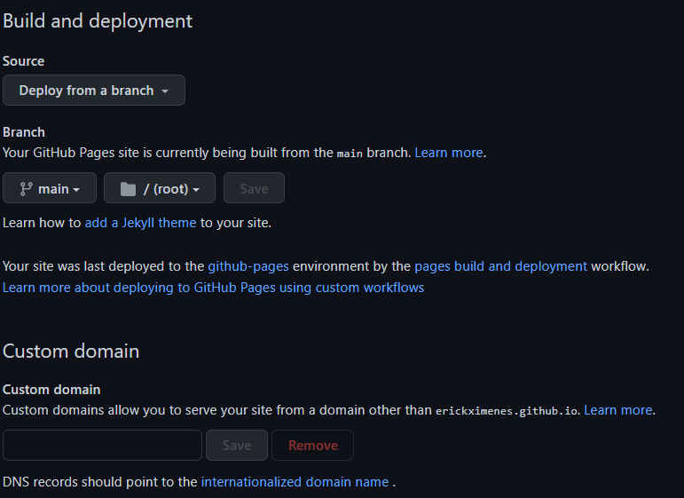

<h1 align="center"> 
	🚀  website 🚀
</h1>

> Projeto que utiliza HTML, CSS e Javascript para criar um website de perfil profissional simples. O Website é "hospedado" no próprio GitHub, basta seguir os passos para realizar as configurações necessárias.

## 💻 Pré-requisitos

Antes de começar, verifique se você atendeu aos seguintes requisitos:
* Saber o básico de HTML
* Ter um conta no GitHub
* Criar um fork ou repository para armazenar os arquivos do projeto.

## 🚀 Configurando website

Com o fork ou repositório com os arquivos criado, vá na guia `Settings` do repositório, no menu lateral clique na opção `Pages` e verifique se está com a seguinte configuração.

## ☕ Usando website

Para utilizar basta acessar o seguinte link alterando com o seu nome de usuário do GitHub e o nome do seu repositório. `https://{nome_usuario}.github.io/{nome_repositoio}`. Exemplo `erickximenes.github.io/website`.

## 🤝 Colaborador

Agradecemos à seguinte pessoa que contribuiu para este projeto:

<table>
  <tr>
    <td align="center">
      <a href="https://www.linkedin.com/in/erick-vasconcelos-50baa8150/" target="_blank">
         
        
          <b>Erick Vasconcelos</b>
         
        
      </a>
    </td>
  </tr>
</table>

[⬆ Voltar ao topo](#inicio) 
